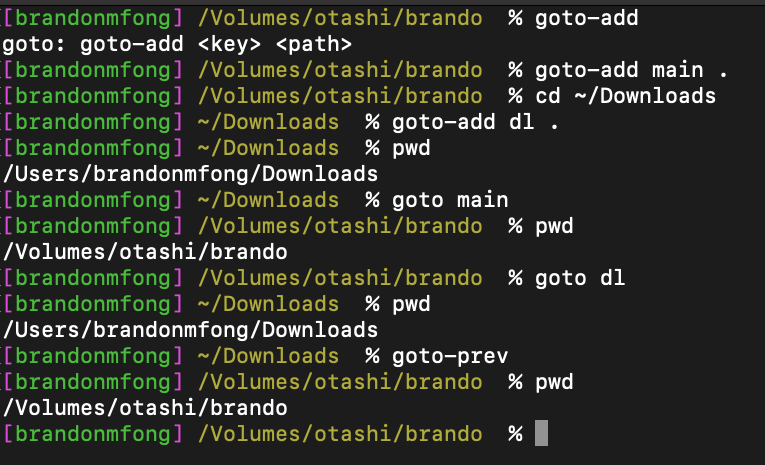

# goto

Simple tool to help you quickly navigate through your file system using terminal

## Installation
1. Download latest [archive](https://github.com/brandonmfong/goto/releases/)
2. Run the `install` script

## Features
- `cd`s you to a directory you nicknamed with a key
- Autocomplete

## Development
- Install rust
- `make`

